# Week 2 Lab Report

### **1. Installing VScode**

Go to the [Visual Studio Code](https://code.visualstudio.com/) website. Follow the instructions (choose Windows or Mac) and download VScode.

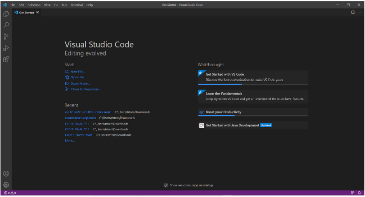

### **2. Remotely Connecting**

If you have Windows, [Install SSH](https://docs.microsoft.com/en-us/windows-server/administration/openssh/openssh_install_firstuse). Then, look up your CSE15L course account [here](https://sdacs.ucsd.edu/~icc/index.php).
Open a new terminal in VScode. Type in your username and add `@ieng6.ucsd.edu` to the end. If a message pops up asking if you want to continue connecting, type yes. Your terminal should now look like this:

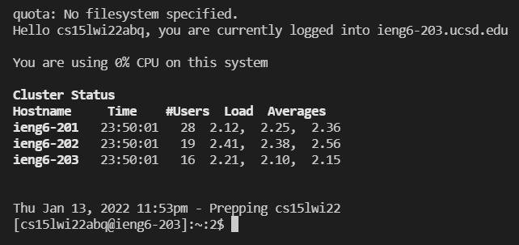

### **3. Trying Some Commands**

Try some commands: cd, pwd, mkdir, and cp. Here's an example of the command ls:

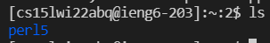

This command lists the files/directories in the directory.

### **4. Moving Files with scp**

The command scp allows you to move files from your computer to a remote computer. To try this, create a new file on your computer.

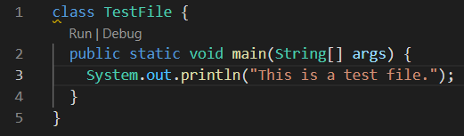

Then, run the command `scp FileName.java cs15lwi22__@ieng6.ucsd.edu:~/` in the terminal, replacing "FileName" with the name of your file and using your own cs15L username. Type in your password. 

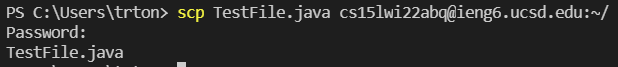

Now, login to ieng6. Use the command ls. You should see your new file now in your home directory.

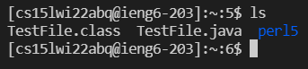

Run the file using javac and java.

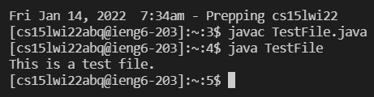

### **5. Setting an SSH Key**

Setting up a public and private key files can take the place of your password when using ssh, which saves time. To do this, use the command `ssh-keygen`. If you're on Windows, follow these [instructions](https://docs.microsoft.com/en-us/windows-server/administration/openssh/openssh_keymanagement#user-key-generation). Set a key.

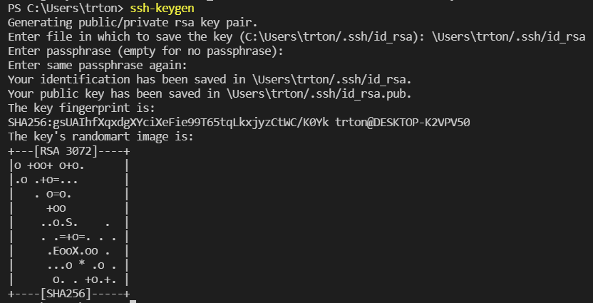

Then, use the command `scp /Users/__/.ssh/id_rsa.pub cs15lwi22__@ieng6.ucsd.edu:~/.ssh/authorized_keys` with your own information to copy your public key to your user account's directory.

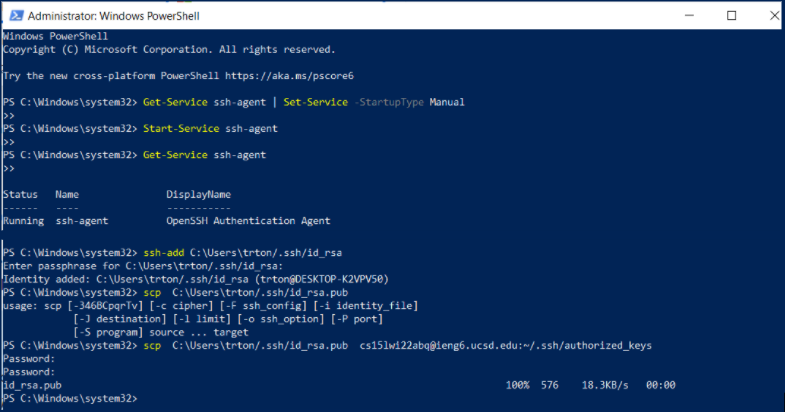

You can now ssh from client to server without entering your password.

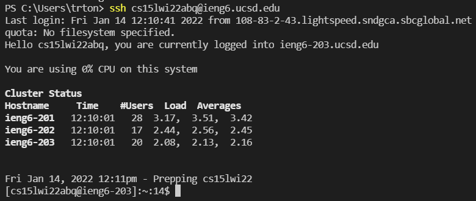

### **6. Optimizing Remote Running**

There are ways to make remote running go smoothly.
* Use the up arrow to use the previous command
* Type a command in quotations after an ssh command in order to run it on the remote server.
* Use a semi-colon in between commands in order to run multiple commands in the same line.

Using the ls command on the remote server (36 keystrokes).

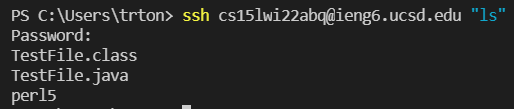
