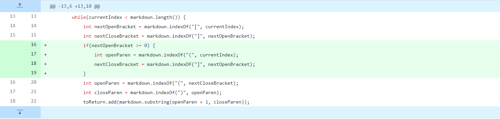
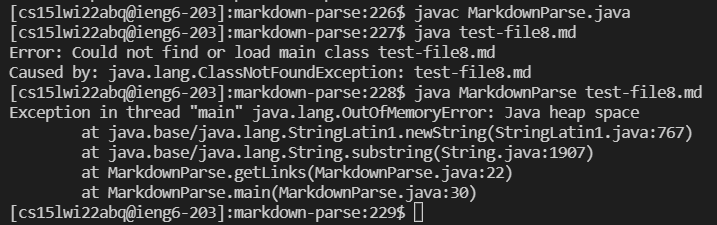
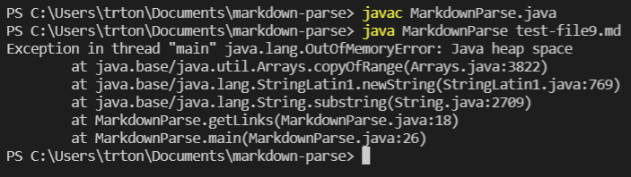

# Week 4 Lab Report 2

### 3 Code Changes

[failure-inducing input 1](https://github.com/trishatong/markdown-parse/blob/3d74f0ba1e903a9f11ea5b636a6a7569fb643100/test-file8.md)

Our code did not account for an open bracket whose index was not at the beginning. This caused the while loop to be infinite.

---

[failure-inducing input 2](https://github.com/trishatong/markdown-parse/blob/3d74f0ba1e903a9f11ea5b636a6a7569fb643100/test-file9.md)

Our code did not account for multiple pairs of brackets and parenthesis and unpaired brackets and parenthesis. Therefore, the open bracket at the end of this file caused an error in the form of an infinite while loop.

---

[failure-inducing input 3](https://github.com/trishatong/markdown-parse/blob/3d74f0ba1e903a9f11ea5b636a6a7569fb643100/test2.md)

The index of the exclamation point "!" was not accounted for when it occurred before an open bracket. Therefore, attempting to return multiple images in a row resulted in no output.
