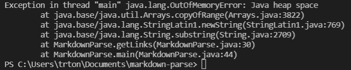

# Week 4 Lab Report 2

### 3 Code Changes

[failure-inducing input 1](https://github.com/trishatong/markdown-parse/blob/3d74f0ba1e903a9f11ea5b636a6a7569fb643100/test-file8.md)

Our code did not account for an updated index. This resulted in an infinite while loop, causing the program to crash.

---

[failure-inducing input 2](https://github.com/trishatong/markdown-parse/blob/3d74f0ba1e903a9f11ea5b636a6a7569fb643100/test-file9.md)

The index of the open bracket was greater than 0. This led to an infinite while loop, which resulted in a symptom in the form of an error.

---

[failure-inducing input 3](https://github.com/trishatong/markdown-parse/blob/3d74f0ba1e903a9f11ea5b636a6a7569fb643100/test2.md)

The index of the exclamation point "!" was not accounted for when it occurred before an open bracket. Therefore, attempting to return multiple images in a row resulted in no output.
