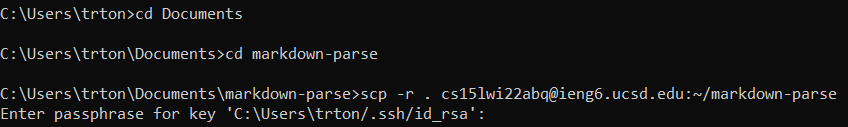
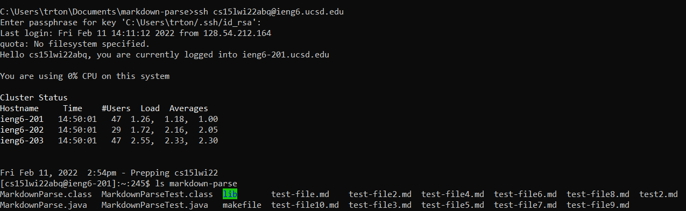
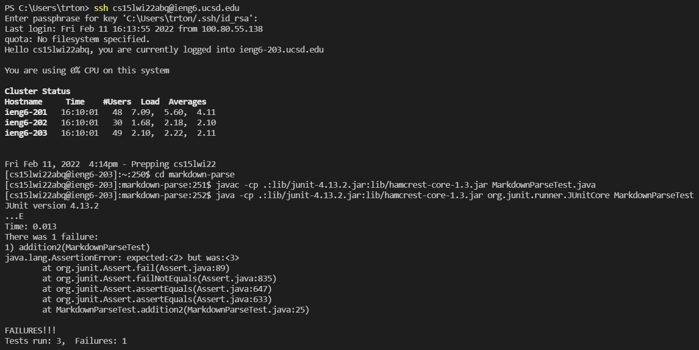
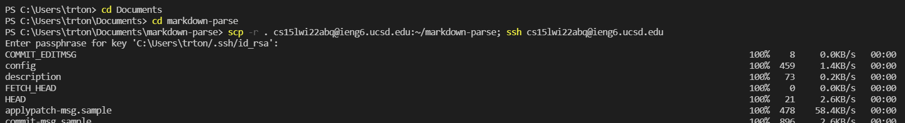

# Week 6 Lab Report 3

First, I changed directories on my local computer in order to access the markdown-parse file. Then, I used the command `scp -r . cs15lwi22abq@ieng6.ucsd.edu:~/markdown-parse` to copy it into the remote ieng6 server.

I now log into the server using ssh. With the command ls markdown-parse, I can see all the files in this directory.

After logging into my ieng6 account, I can compile and run the MarkdownParse tests. I run them using javac and java commands.

I can run the scp and the ssh commands together. I use a semicolon ";" to do this.
