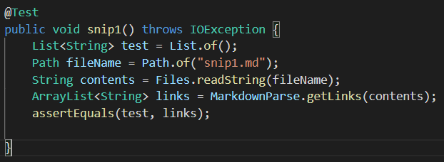
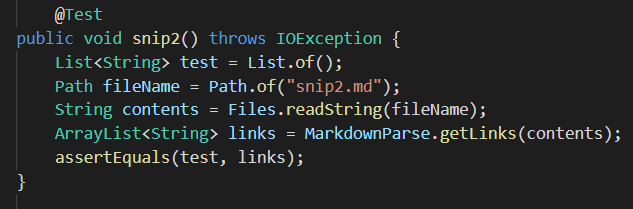
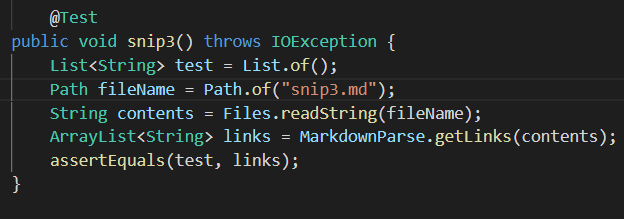

[My repository](https://github.com/trishatong/markdown-parse)

[Reviewed repository](https://github.com/Obarquinho/markdown-parse)

Snippet 1

JUnit test for Snippet 1

My repository:

- expected: [`google.com, google.com, ucsd.edu]
- output: [url.com, `google.com, google.com, google.com]

Reviewed repository:

- expected: [`google.com, google.com, ucsd.edu]
- output: [url.com, `google.com, google.com]

Snippet 2

JUnit test for Snippet 2

My repository:

- expected: [a.com, a.com(()), example.com]
- output: [a.com, a.com, a.com((]

Reviewed repository:

- expected: [a.com, a.com(()), example.com]
- output: [a.com, a.com((]

Snippet 3

JUnit test for Snippet 3

My repository:

- expected: [https://www.twitter.com, https://ucsd-cse15l-w22.github.io/, https://cse.ucsd.edu/]
- output: [
    https://www.twitter.com
, 
    https://ucsd-cse15l-w22.github.io/
, github.com

And there's still some more text after that.

[this link doesn't have a closing parenthesis for a while](https://cse.ucsd.edu/

, https://cse.ucsd.edu/

]

Reviewed repository:

- expected: [https://www.twitter.com, https://ucsd-cse15l-w22.github.io/, https://cse.ucsd.edu/]
- output: [
    https://www.twitter.com
, 
    https://ucsd-cse15l-w22.github.io/
, github.com

And there's still some more text after that.

[this link doesn't have a closing parenthesis for a while](https://cse.ucsd.edu/

]

Questions
1. Do you think there is a small (<10 lines) code change that will make your program work for snippet 1 and all related cases that use inline code with backticks? If yes, describe the code change. If not, describe why it would be a more involved change.

Yes: I would need to include a case that accounts for back ticks. Back ticks indicate a piece of code and should not be included in a valid link.

2. Do you think there is a small (<10 lines) code change that will make your program work for snippet 2 and all related cases that nest parentheses, brackets, and escaped brackets? If yes, describe the code change. If not, describe why it would be a more involved change.

No: I think I would need to think of a multitude of cases accounting for nested parentheses, brackets, and escaped brackets. These cases would take up many lines of code.

3. Do you think there is a small (<10 lines) code change that will make your program work for snippet 3 and all related cases that have newlines in brackets and parentheses? If yes, describe the code change. If not, describe why it would be a more involved change.

Yes: I think it could be possible to change my program so that all related cases that have newlines in brackets and parentheses are accounted for. I could maybe use a for loop in order to cover every newline; this wouldn't take too many lines.

