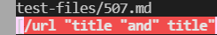
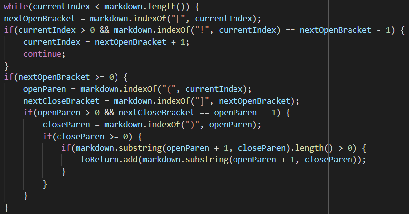
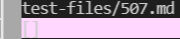
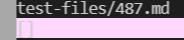

To find the tests with different results, I used diff: `diff markdown-parse/results.txt lab9/markdown-parse/results.txt`

**Test 1**:
`[link](/url "title "and" title")`

My implementation:

 What's wrong: Needs to account for ](/ in a row
 
 

Provided implementation:

Expected output: [link](/url "title "and" title")

---

**Test 2**:
`[link](/my uri)`

My implementation:

What's wrong: Needs to account for ](/ in a row

Provided implementation:

Expected output: [link](/my uri)
